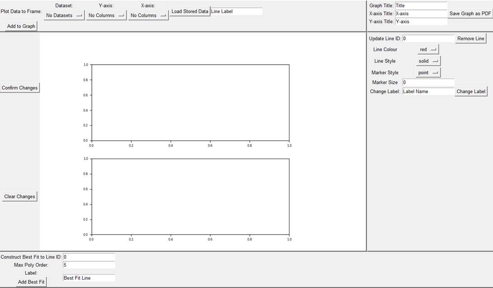
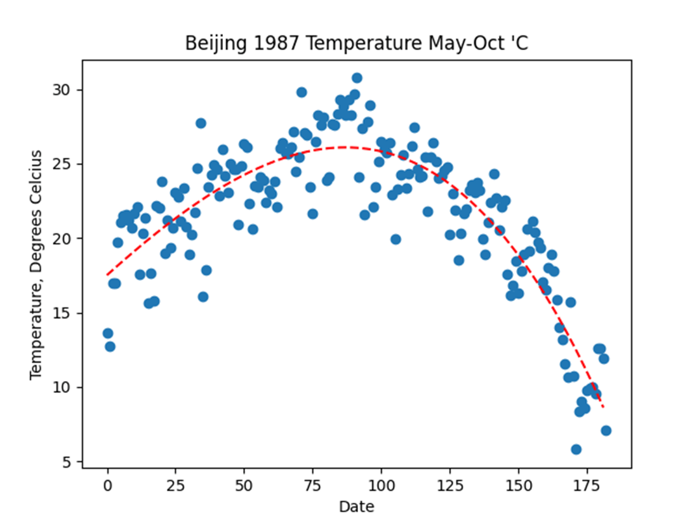
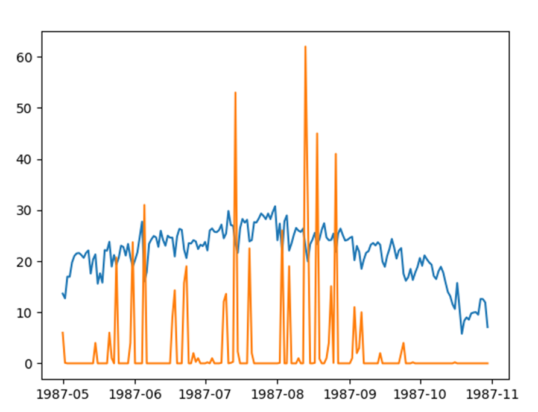

# DataSetAnalyser
###### Important Note: This project was built for Python 2.7, and not the latest versions. Due to this, it can be considered rather outdated.

This was my Computer Science A Level NEA project.

It was built around analysing the [Large Data Set](https://qualifications.pearson.com/content/dam/pdf/A%20Level/Mathematics/2017/specification-and-sample-assesment/Pearson%20Edexcel%20GCE%20AS%20and%20AL%20Mathematics%20data%20set%20-%20Issue%201%20%281%29.xls), and intended to also have the capability to extract and analyse the data of any other suitable .xls or .csv files.

## Report Document
If you are interested in a proper breakdown of this project - planning, functionalities,
and development - then I will direct you to the [full report pdf](ALevel%20NEA%20Document%20Final.pdf).

## Capabilities
The program could parse data from .csv or .xls files. The user could then produce a 
visible graph of the data, and modify it to their needs. This includes adding in titles, 
axis labels, and lines of best fit to the data:

[Video Demonstration](https://youtu.be/5wf88BOlhTA)

The user was also capable of overlaying multiple sets of data within the graph, allowing
for easy comparison of data to determine trends, with the orange graph representing 
rainfall, and blue temperature:

## Video Uploads
Uploads of the project can be found [here](https://www.youtube.com/@callumwilkie-mv8nx).
Short clips demonstrate the various features of the program, albeit that some issues
remain present at times.

